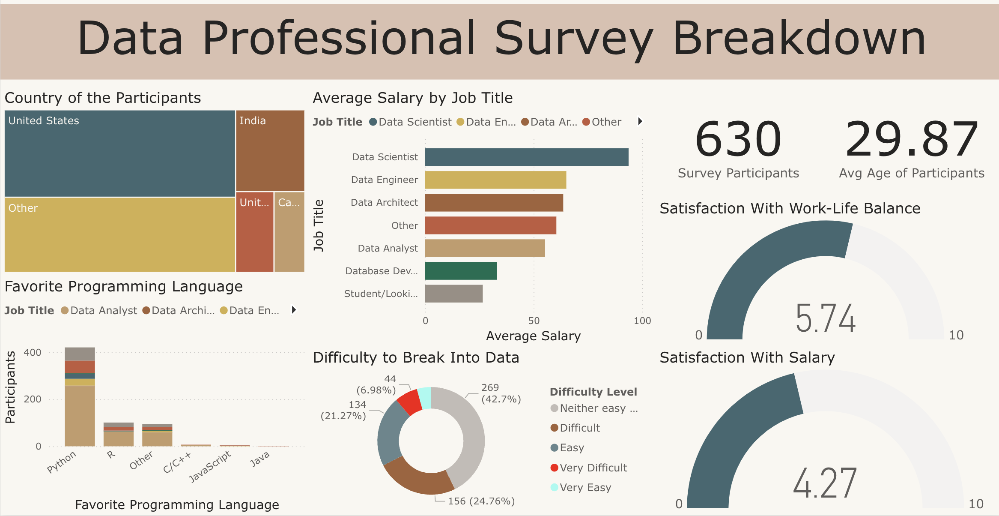

# Data Analyst
**Technical Skills:** Python, SQL, AWS, Tableau

**Certifications:**
- [AWS Certified AI Practitioner](https://www.credly.com/badges/af46ba32-1dd7-4497-9e29-4df239d0d984/public_url)
- [AWS Certified Cloud Practitioner](https://cp.certmetrics.com/amazon/en/public/verify/credential/be158612dd60443d8ef5b7a11324d690)
- [Google Advanced Data Analytics](https://www.coursera.org/account/accomplishments/specialization/R0J2B31APIOD)
- [Certified Scrum Product Owner](https://badgecert.com/bc/html/groupbadges.html?k=Ri9wNFVHK1lOeDhOcnMvWnRZcG9rams0cTkybW0yb2Q)

## Education
- Master of Engineering Management&nbsp;&nbsp;&nbsp;&nbsp;&nbsp;&nbsp;&nbsp;&nbsp;&nbsp;Illinois Tech (_Dec 2024_)

## Work Experience

<strong>AI Product Manager @ Illinois Tech (<i>Dec 2024 - Present</i>)</strong>

<ul>
  <li>Prototyped a RAG chatbot using LangChain and Hugging Face, aligning responses with webpages to improve accuracy by 30%</li>
  <li>Developed a Python/ChromaDB knowledge hub with semantic search, cutting query resolution time by 3x for departmental FAQs</li>
  <li>Deployed chatbot integration with FastAPI, PostgreSQL, and cloud storage, driving a 50% increase in self-service resolution rates</li>
</ul>

 

<strong>Data Analyst @ Illinois Tech (<i>Apr 2023 - Dec 2024</i>)</strong>

<ul>
  <li>Built an ETL pipeline using Python (Pandas/NumPy) to cut down manual effort by improving operational efficiency by 20%</li>
  <li>Conducted analysis using Python, identifying patterns that improved decision-making by 25%, visualized through Tableau dashboards</li>
  <li>Redesigned the check-in process by digitizing workflows and adding new features, reducing errors and saving $20,000 annually</li>
</ul>

 

<strong>Senior Data Analyst @ TheMathCompany (<i>Feb 2022 - Oct 2022</i>)</strong>

<ul>
  <li>Modelled recruitment KPIs (referrals, cycle time) via SQL analysis, boosting hiring efficiency 20% through workflow redesign</li>
  <li>Designed Excel dashboards to surface hiring bottlenecks, cutting manual reporting 20hrs/month and enabling real-time optimization</li>
  <li>Translated talent analytics into predictive dashboards, aligning HR strategy 25% via data storytelling for workforce planning</li>
</ul>

 

<strong>Data Analyst @ Crowdstaffing (<i>Oct 2018 - Feb 2022</i>)</strong>

<ul>
  <li>Optimized recruitment strategies via SQL/Excel market analysis, driving $50K revenue growth through targeted talent sourcing000</li>
  <li>Engineered ETL pipelines to standardize talent records, enhancing data accuracy by 20% for cross-departmental reporting</li>
  <li>Delivered workforce insights through Excel analytics, influencing evidence-based policy changes that reduced attrition by 15%</li>
</ul>

 

## Projects
**Project 1: Data Analytics Capstone Project**

Predicting user churn is critical for businesses to retain their customers and optimize growth. In this project, I built a machine learning model called User Churn Prediction Model to predict user churn for the Waze app, identifying who is likely to churn, why, and when
- Conducted data cleaning, exploratory analysis, and hypothesis testing to uncover patterns in user behavior
- Developed a logistic regression model and fine-tuned Random Forest and XGBoost algorithms for accurate predictions
- Gained insights into churn drivers, enabling actionable strategies to improve user retention

Tech Stack: Python, Pandas, NumPy, Scikit-learn, Matplotlib, Seaborn, XGBoost

[Discover more](https://github.com/ShreeramHiriyanna/Data_Analytics_Capstone_Project)

**Project 2: Workforce Trends - Data Cleaning and Insights on Layoffs**

Efficiently preparing raw datasets is essential for accurate insights. In this project, I cleaned and analyzed a layoffs dataset to uncover trends in company, industry, and country-wide layoffs, enabling data-driven decision-making
- Addressed duplicates, standardized formats, and resolved null values to ensure data integrity
- Conducted exploratory analysis to reveal insights into layoff trends, including temporal patterns, industry impacts, and rolling summations
- Created structured datasets and actionable visualizations for strategic insights

Tech Stack: SQL (MySQL)

[Discover more](https://github.com/ShreeramHiriyanna/EDA_SQL_LayoffsData)

**Project 3: Insights Unlocked - Data Professional Survey Dashboard**

Transforming raw survey data into actionable insights, this project provides a comprehensive analysis of the data professional landscape using Power BI. The interactive dashboard delivers key insights into demographics, job roles, programming preferences, and satisfaction levels
- Cleaned and standardized raw survey data for clarity and consistency
- Created advanced visualizations, including treemaps, stacked charts, and gauges, to illustrate survey findings
- Delivered actionable insights into average salaries, programming preferences, and work-life balance among data professionals.

Tech Stack: Power BI

